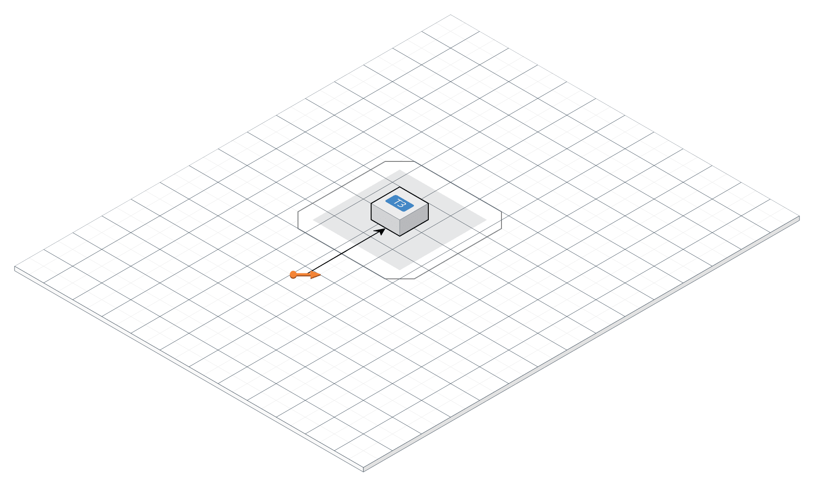
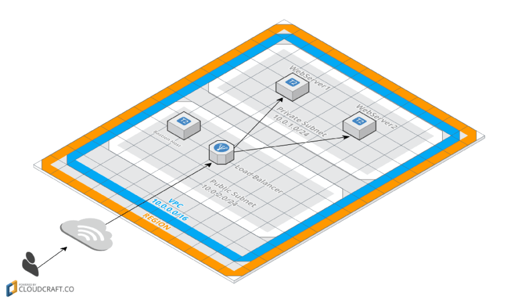

terraform-topologies
---

Reference terraform topologies for future deployments.
Take it and use it

## Topologies

#### General
General example topologies
1. **Modules**: Using modules and local_exec
2. **Backends**: Using backends

#### AWS
Amazon web services specific.

1. **Instance with Ip**: Single instance with elastic ip

2. **VPC**: See [article](https://dev.to/duduribeiro/creating-your-cloud-servers-with-terraform-2lpd)

## LICENCE
Copyright © 2017 Theo Despoudis MIT license